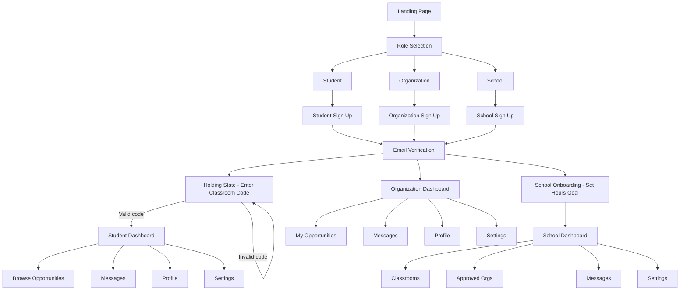
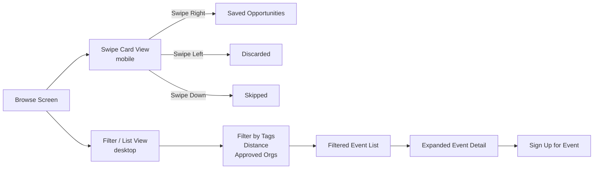
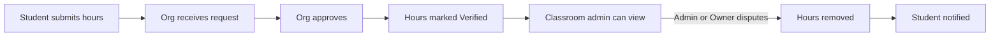
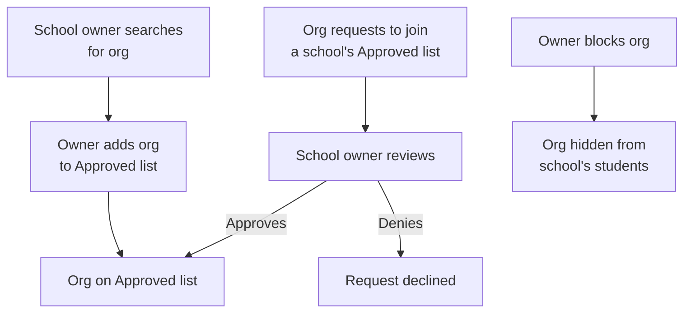
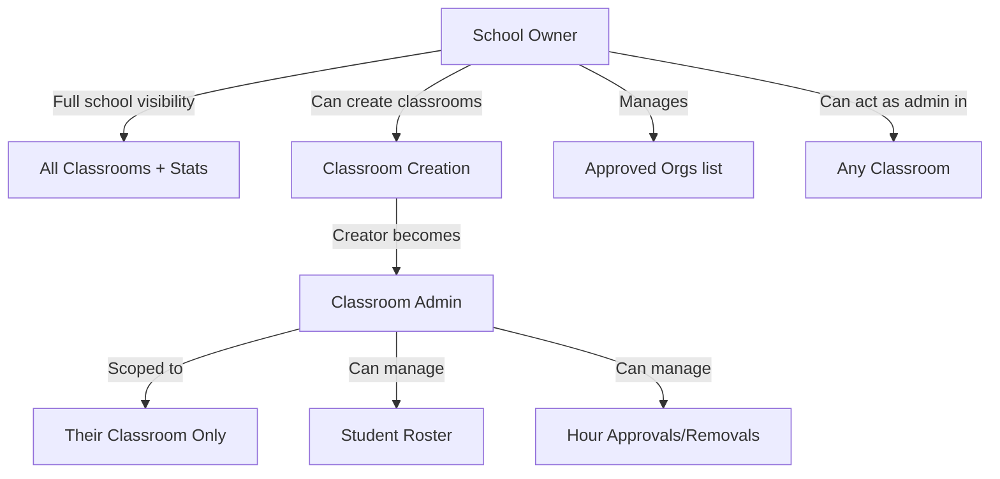

# Hourly — Functionality List

> Three user roles: **Student (Volunteer)**, **Organization**, **School (Owner + Classroom Admins)**.
> This is a school-first app. Students must be attached to a classroom to use the product.

---

## App-Level Flow Map

---

## 1. Sign In / Get Started Page

- App name and branding (Hourly)
- Subheading and description of what the app does
- Three value propositions: For Students, For Schools, For Non-Profits
- **Sign In** button (existing users)
- **Get Started** button → leads to role selection
- Footer: Help & Support, Terms/Privacy

---

## 2. Sign Up Flow

### 2.1 Role Selection
- Three paths: *I'm a student*, *I'm an organization*, *I'm a school*

### 2.2 Student Sign Up
- Fields: Name, Email, Age, Password
- No school/classroom selection at sign-up — this happens after email verification in the holding state

### 2.3 Organization Sign Up
- Fields: Organization Name, Email, Password, Collaborators (optional)
- Zip code(s) the organization wants to target — used for proximity sorting in student opportunity browsing

### 2.4 School Sign Up
- Fields: School Name, Email, Password
- Zip code(s) of the school — used for proximity matching with orgs
- After email verification, owner is prompted to set the **school-wide graduation hours goal** before accessing the dashboard
  - This number applies to all classrooms under the school
  - Can be changed later in Settings by the owner only

### 2.5 Email Verification
- Confirmation message sent to registered email
- Access to any dashboard state is blocked until the link is clicked

---

## 3. Student

### 3.1 Holding State
- Shown immediately after email verification, before joining a classroom
- Blank screen with a single classroom code input field
- Code is a string of lowercase letters and numbers
- If code is invalid: display "Invalid code" message, allow retry
- If no classroom exists yet at a school, the student cannot proceed until one is created and they receive the code
- Once a valid code is entered, student is enrolled in the classroom and gains full app access

### 3.2 Home / Dashboard
- Stats bar: **Committed Hours**, **Verified Hours**, **Activities Done**
- Progress toward graduation hours goal (set by school)
- **Upcoming Events** list, sorted by date
  - Each event row shows: date/time range, activity title, address, volunteer slots filled (e.g. 5/10)
  - Clicking an event expands it to show: description, tags, location, time, volunteers needed, age requirement, and other org-defined fields

### 3.3 Browse Opportunities

- **Ordering logic**: Approved orgs (as designated by the student's school) always appear first. Remaining orgs are soft-sorted by distance from the school's zip code — closest first. Distance is also available as an explicit filter.
- **Swipe card view** (mobile):
  - Each card shows: event name, org name, description, location, time, slots filled
  - Swipe right → Save, Swipe left → Discard, Swipe down → Skip
- **Filter / List view** (desktop):
  - Filter by: tags, distance radius, approved orgs only
  - Scrollable results list, tapping expands full event detail
- **Saved Opportunities** tab — events saved to sign up for later
- **Skipped/Discarded** tab — recoverable list

### 3.4 Messages
- Inbox list view with sender name and preview
- Students can message organizations directly
- **New Message** composer: To, Subject, body, Send
- Receive inline notifications: hour approvals, hour removals

### 3.5 Profile
- Profile picture, Name, Email, Phone, Biography
- Websites / Social links: Instagram, TikTok, Twitter, YouTube
- Hours Signed Up For display
- Current classroom displayed (read-only)
- **Edit Profile**: Name, Grade, Description, Change Photo

### 3.6 Switching Classrooms
- Student can leave current classroom and enter a new classroom code
- Verified hours carry over to the new classroom
- Previous classroom admin receives notification: "[x] student has left the classroom"
- New classroom admin can see the student's full hour history

### 3.7 Settings
- **Security**: Change Password, 2-Factor Authentication
- **Notifications** (all on by default):
  - Remind me ___ hours before event starts
  - Notify me if an event changes
  - Notifications when hours get approved or removed
  - Weekly summary of hours earned
  - When someone assigns me a task
  - Weekly activity summary
  - Per-notification toggle: Email / In-App
- **Privacy** (School-only by default):
  - Profile Visibility: Public / School-only
- **Messages** (Everyone by default):
  - Allow messages from: Everyone / Organizations / Admins / All Staff
  - Organize messages preference
- **Data**:
  - Export activity log (CSV / PDF)
  - Delete account (requires email confirmation, permanent)
- **Log Out**

---

## 4. Organization

### 4.1 Dashboard
- **Recent Activity Feed**: e.g. "3 students signed up for Food Drive", "10 hours pending approval for Jane D.", "Event created"
- Quick actions: **Create Opportunity**, **Make Announcement**

### 4.2 My Opportunities
- List of all created opportunities with edit access
- **Create Opportunity** form:
  - Event Name, Location, Date, Recurring toggle, Time
  - Volunteers Needed, Age Requirement
  - Tags (multi-select, addable)
  - Description
  - Additional fields selectable via "Select More"
- **Edit Details** on existing opportunities

### 4.3 Hour Approval

- Incoming requests listed: "[x] asked for approval of N hours at [Event]"
- Org approves → hours immediately marked **Verified** on the student's profile
- Classroom admins and school owner can later remove verified hours
- Student is notified when hours are removed

### 4.4 Messages
- Inbox with messages from students, other schools, and organizations
- Org can sort/filter inbox by: students, schools, organizations
- Priority flag on messages
- **New Message** composer

### 4.5 School Relationship Management

- Org can request to be added to a specific school's Approved Orgs list
- Org can see which schools have approved them
- If a school blocks the org, the org is not notified but its opportunities will not appear for that school's students

### 4.6 Profile
- Organization Name, Email, Phone, Description
- Target zip codes (editable)
- Websites / Social links
- **Edit Profile**

### 4.7 Settings
- **Security**: Change Password, 2-Factor Authentication, Add/Remove Collaborators
- **Notifications**:
  - New student sign-ups for events
  - Hour approval requests
  - New school approval requests
  - Toggle: Email / In-App
- **Messages** (Everyone by default):
  - Who can send messages: Everyone / Organizations / Schools
  - Archive messages after ___ months
- **Analytics**:
  - Message engagement / response time
  - Average response time
  - Most active students
- **Privacy** (Public by default):
  - Default visibility: Public / Schools-only / Invite-only
  - Profile Visibility
- **Data**:
  - Student volunteer data export
- **Log Out**

---

## 5. School

### 5.1 Roles

- **Owner**: created the school account; sees all classrooms and school-wide stats; manages Approved Orgs; can create classrooms and act as admin within any of them; sets and changes the hours goal; approves/denies org requests; can transfer the owner role to another school member — upon transfer, the previous owner loses all access to the school entirely. Prompt with a warning and ask for confirmation before transfering.
- **Classroom Admin**: created when a classroom is created (the creator becomes the admin); scoped entirely to their classroom; can manage roster, hours, and messages within that classroom; can request to transfer their admin role to another school member, but the transfer requires owner approval — upon approval, the previous admin loses all classroom access entirely. Prompt with a warning and ask for confirmation before transfering.

### 5.2 School Dashboard (Owner view)
- School-wide stats: total hours, % students on track, students at risk count, graduation goal completion (e.g. 315/350 students)
- Per-classroom summary cards: classroom name, admin name, student count, completion rate, at-risk count
- Quick links: **View On-Track Students**, **View Off-Track Students** (school-wide)

### 5.3 Classroom Management
- Owner can create a classroom — on creation, the owner becomes the classroom's admin
- Classroom admin role can be transferred by the admin, but requires owner approval — the previous admin loses all classroom access upon transfer
- School owner role can be transferred by the owner to any school member — the previous owner loses all school access upon transfer
- Each classroom auto-generates a unique code (lowercase letters and numbers) on creation
- Classroom code is displayed and copyable from the classroom settings
- Owner sees all classrooms; classroom admin only sees their own

### 5.4 Classroom Dashboard (Admin view)
- Classroom-level stats: total hours, % on track, at-risk count, goal completion
- **Student Roster**:
  - Searchable with filters: All, Completed, On Track, At Risk, Not Started
  - Per-student row: name, verified hours vs goal, hours pending approval, Last Activity date
  - Actions per student: **Send Reminder**, **View Hour History**, **Remove Hours**
- Receive notifications when a student leaves the classroom

### 5.5 Approved Orgs (Owner only)

- Owner can search for registered organizations by name or zip code
- Owner can add an org to the school's **Approved Orgs** list
- Owner can receive and approve/deny incoming requests from orgs who want to be on the list
- Owner can **block** an org — blocked orgs' opportunities are hidden from all students in the school
- Approved orgs appear at the top of the opportunity list for all students in the school, above distance-sorted results

### 5.6 Hour Management
- Both owner and classroom admins can remove verified hours for students in their scope
- Removal triggers a notification to the affected student
- Owner can remove hours for any student school-wide; admin only within their classroom

### 5.7 Messages
- Inbox/composer same pattern
- Owner can message any student, admin, or org
- Admin can message students within their classroom and orgs
- Receive at-risk alerts, hour-related notifications, org approval requests (owner only)

### 5.8 Settings
- **School**: Graduation hours goal (owner only), School zip codes (owner only)
- **Notifications**:
  - New student joins a classroom
  - Student leaves a classroom
  - Hour approval activity
  - Org requests to join Approved list (owner only)
  - Weekly activity summary
  - Toggle: Email / In-App
- **Messages**:
  - Who can send messages
  - Organize messages preference
- **Privacy**: Profile Visibility, Location Sharing
- **Data**: Export activity log (CSV / PDF)
- **Log Out**
